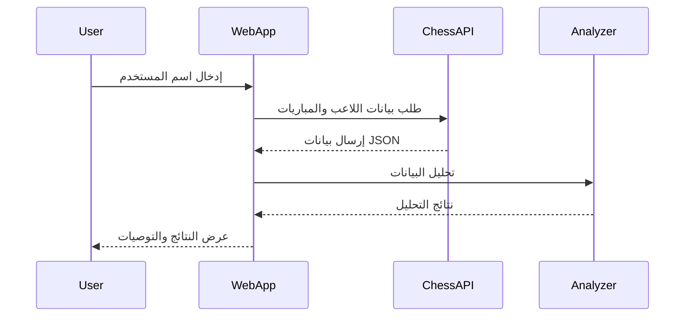

# Chess Analyzer Algeria Advanced

مشروع **Chess Analyzer Algeria Advanced** هو موقع ويب متقدم لتحليل مباريات الشطرنج باستخدام بيانات Chess.com، مع دعم اللغة العربية وواجهة سهلة الاستخدام. يتيح للمستخدمين تحليل مبارياتهم، استكشاف نقاط القوة والضعف، ومقارنة الأداء عبر الزمن.

---

## محتوى المشروع

```
├── app.py                # التطبيق الرئيسي (Flask)
├── requirements.txt      # متطلبات التشغيل (Python)
├── static/               # ملفات ثابتة (CSS, JS, صور)
│   ├── css/
│   │   └── style.css     # تنسيقات الموقع
│   ├── js/
│   │   └── main.js       # وظائف جافاسكريبت
│   └── images/           # صور وأيقونات
└── templates/            # قوالب HTML
    ├── base.html         # القالب الأساسي
    ├── index.html        # الصفحة الرئيسية
    ├── analysis.html     # صفحة التحليل
    └── results.html      # صفحة النتائج
```

---

## اللغات والتقنيات المستخدمة

- **Python 3**  
  لتحليل البيانات ومعالجة المباريات.
- **Flask**  
  إطار عمل ويب خفيف وسهل.
- **HTML5, CSS3, JavaScript**  
  لبناء واجهة المستخدم وتنسيق الصفحات.
- **Chess.com API**  
  لجلب بيانات اللاعبين والمباريات.
- **chess & chess.pgn**  
  مكتبة بايثون لتحليل مباريات الشطرنج.
- **لغة عربية**  
  دعم كامل للواجهة والنصوص.

---

## شرح عمل الموقع

1. **إدخال اسم المستخدم**  
   يدخل المستخدم اسم حسابه في Chess.com.
2. **جلب وتحليل المباريات**  
   يتم جلب آخر مباريات المستخدم وتحليلها تلقائياً.
3. **عرض النتائج**  
   تظهر إحصائيات مفصلة، نقاط القوة والضعف، وتحليل الافتتاحيات.
4. **تصدير التحليل**  
   يمكن للمستخدم تحميل تقرير التحليل بصيغة JSON.

---

## مخطط معماري (Architecture Diagram)

```mermaid
flowchart TD
    A[المستخدم] -->|يدخل اسم المستخدم| B[واجهة Flask]
    B -->|طلب بيانات| C[Chess.com API]
    C -->|يرسل بيانات| B
    B -->|تحليل البيانات| D[محلل الشطرنج (Python)]
    D -->|نتائج التحليل| B
    B -->|عرض النتائج| E[واجهة HTML/CSS/JS]
```

---

## مخطط تدفق البيانات (Data Flow)



---

## مميزات إضافية

- دعم جلسات طويلة وتحليل متقدم.
- تخزين مؤقت للبيانات الكبيرة خارج الكوكيز.
- تنظيف تلقائي للملفات المؤقتة.
- تصفية وتحليل حسب نوع المباراة، الافتتاحية، الخصم، إلخ.
- واجهة عربية بالكامل.

---

## طريقة التشغيل

1. تثبيت المتطلبات:
   ```
   pip install -r requirements.txt
   ```
2. تشغيل التطبيق:
   ```
   python app.py
   ```
3. الدخول عبر المتصفح إلى:
   ```
   http://127.0.0.1:5000
   ```

---

## مساهمات

للمساهمة أو الإبلاغ عن مشاكل، يرجى التواصل عبر البريد أو فتح Issue على GitHub.

---

**صنع في الجزائر 🇩🇿**
